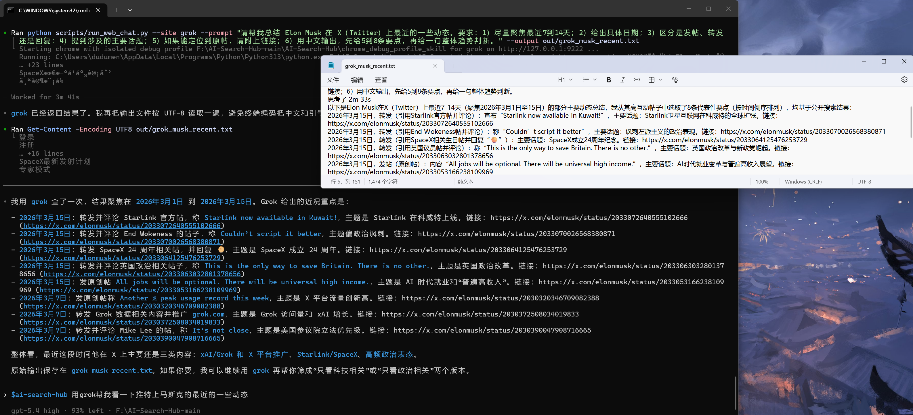
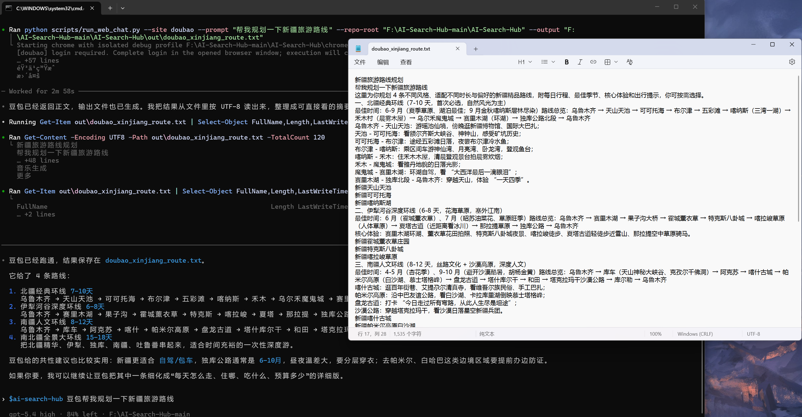
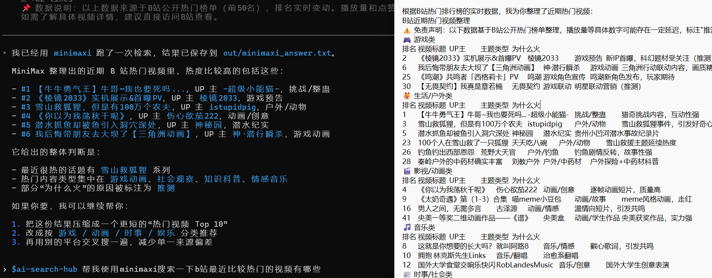

<div align="center">

# AI Search Hub

### 一次提问，全域搜索。

[English](README.en.md)

[](https://github.com/minsight-ai-info/AI-Search-Hub)
[](https://github.com/minsight-ai-info/AI-Search-Hub)
[](https://github.com/minsight-ai-info/AI-Search-Hub)
[](https://github.com/minsight-ai-info/AI-Search-Hub)

<p>
  
  
  
  
  
  
  
  
  
</p>

**一个聚合多平台 AI 原生搜索能力的开源 Skill。**
**免费获取微信公众号、抖音、微博、B站等数据，通过大厂 AI 平台帮你搜集、清洗、整理，为你的 OpenClaw 装上更强的搜索、抽取与数据借力能力。**

**如果觉得项目对你有帮助，求一个免费的🌟**

</div>

---

## 把大厂原生搜索框架接进你的 OpenClaw

AI Search Hub 是一个开源 Skill，用来把分散在不同 AI 平台里的搜索能力、网页抽取能力，以及它们背后各自公司的原生数据世界，整理成一个可复用的搜索与抽取中枢。

你不只可以一次提问、全域搜索。给它一个链接，也能直接借力大厂已经打磨好的网页理解、搜索与抽取能力。更重要的是，你可以通过这些 AI 平台去拿微信公众号、抖音、微博等它们更容易触达的数据，再让它们替你完成搜集、清洗、整理，最后统一接进自己的 Agent 与工作流。

它不想让你继续维护：

- 一堆脆弱爬虫和网页解析规则
- 每个平台各自一套浏览器自动化和登录流
- 反复登录、验证码、限流、风控处理
- 自己去啃公众号、抖音、微博、公开网页这些分散入口
- 给了链接还要自己抓正文、去广告、去噪、提重点、做结构化整理
- 最后还要人工拼接碎片结果

它想做的事情很直接：

> **给一个问题，让这些平台替你搜；给一个链接，让这些平台替你抓、替你读、替你清洗整理，再把结果统一回收给你的 Agent。最难拿的数据入口，直接让大厂替你打工。**

<table width="100%">
  <tr>
    <td width="33.33%" align="center">
      
      <br>
      <sub>Grok 抓去推特指定主题信息</sub>
    </td>
    <td width="33.33%" align="center">
      
      <br>
      <sub>豆包获取抖音平台内信息</sub>
    </td>
    <td width="33.33%" align="center">
      
      <br>
      <sub>MiniMax 获取B站视频信息</sub>
    </td>
  </tr>
</table>


---

## 传统方案 vs AI Search Hub

<table width="100%">
  <thead>
    <tr>
      <th align="left" width="50%">传统方案</th>
      <th align="left" width="50%">AI Search Hub</th>
    </tr>
  </thead>
  <tbody>
    <tr>
      <td>🔧 <strong>自己写爬虫</strong><br><sub>抓取、解析、维护都得自己承担</sub></td>
      <td>⚡ <strong>直接复用平台原生搜索</strong><br><sub>少造轮子，直接接入成熟搜索入口</sub></td>
    </tr>
    <tr>
      <td>🧩 <strong>一个平台一套自动化</strong><br><sub>每接一个平台就新增一份维护成本</sub></td>
      <td>🚀 <strong>一次提问，多平台分发</strong><br><sub>统一入口，把多个平台放进同一条链路</sub></td>
    </tr>
    <tr>
      <td>🛡️ <strong>反复处理风控与验证码</strong><br><sub>登录、限流和页面变化持续消耗精力</sub></td>
      <td>🎯 <strong>尽量沿用平台已有入口</strong><br><sub>减少重复对抗，把精力留给结果聚合</sub></td>
    </tr>
    <tr>
      <td>🔍 <strong>自己调关键词和检索策略</strong><br><sub>需要不断试错才能逼近可用结果</sub></td>
      <td>🧠 <strong>借助平台已优化好的搜索逻辑</strong><br><sub>复用平台已有的排序、理解和体验</sub></td>
    </tr>
    <tr>
      <td>🧱 <strong>结果分散、要手工拼接</strong><br><sub>最后还得自己整合成统一输出</sub></td>
      <td>📦 <strong>统一输出给 Agent / Workflow</strong><br><sub>把多平台结果回收到一个可复用出口</sub></td>
    </tr>
  </tbody>
</table>

---

## 支持平台

这些平台不是附属补充，而是 AI Search Hub 当前编排的核心搜索入口。

**当前已接入：`Gemini` / `Grok` / `豆包` / `元宝` / `LongCat` / `通义千问` / `MiniMax`**

<table width="100%">
  <thead>
    <tr>
      <th align="left" width="24%">平台</th>
      <th align="left" width="30%">擅长方向</th>
      <th align="left" width="30%">典型覆盖</th>
      <th align="left" width="16%">当前状态</th>
    </tr>
  </thead>
  <tbody>
    <tr>
      <td><strong>Gemini</strong><br><sub>Google-first discovery</sub></td>
      <td><code>Google 搜索</code> <code>网页发现</code> <code>知识内容</code></td>
      <td><code>Google</code> <code>公开网页</code> <code>知识站点</code></td>
      <td></td>
    </tr>
    <tr>
      <td><strong>Grok</strong><br><sub>Real-time social search</sub></td>
      <td><code>X / Twitter</code> <code>实时动态</code> <code>热点讨论</code></td>
      <td><code>实时舆情</code> <code>趋势话题</code> <code>社交信号</code></td>
      <td></td>
    </tr>
    <tr>
      <td><strong>豆包</strong><br><sub>Chinese trend sensing</sub></td>
      <td><code>中文理解</code> <code>热点话题</code> <code>内容归纳</code></td>
      <td><code>抖音</code> <code>中文内容生态</code> <code>热门内容</code></td>
      <td></td>
    </tr>
    <tr>
      <td><strong>元宝</strong><br><sub>Chinese source supplement</sub></td>
      <td><code>中文补充检索</code> <code>公众号信源</code> <code>内容交叉验证</code></td>
      <td><code>微信公众号</code> <code>中文网页</code> <code>公开内容</code></td>
      <td></td>
    </tr>
    <tr>
      <td><strong>LongCat</strong><br><sub>Chinese knowledge blend</sub></td>
      <td><code>中文知识</code> <code>行业信息</code> <code>结构化总结</code></td>
      <td><code>中文知识库</code> <code>行业报告</code> <code>公开信息</code></td>
      <td></td>
    </tr>
    <tr>
      <td><strong>通义千问</strong><br><sub>Chinese web expansion</sub></td>
      <td><code>中文搜索</code> <code>网页问答</code> <code>公开内容</code></td>
      <td><code>中文网页</code> <code>搜索入口</code> <code>公开信息</code></td>
      <td></td>
    </tr>
    <tr>
      <td><strong>MiniMax</strong><br><sub>General Chinese assistant</sub></td>
      <td><code>中文问答</code> <code>通用助手</code> <code>生活类问题</code></td>
      <td><code>中文日常问题</code> <code>泛知识问答</code> <code>消费类查询</code></td>
      <td></td>
    </tr>
    <tr>
      <td><strong>Kimi</strong><br><sub>Long-context exploration</sub></td>
      <td><code>长上下文</code> <code>文档阅读</code> <code>信息整理</code></td>
      <td><code>长文内容</code> <code>研究资料</code> <code>公开网页</code></td>
      <td></td>
    </tr>
    <tr>
      <td><strong>Perplexity</strong><br><sub>Web-native answer engine</sub></td>
      <td><code>网页搜索</code> <code>来源引用</code> <code>快速摘要</code></td>
      <td><code>公开网页</code> <code>新闻站点</code> <code>知识内容</code></td>
      <td></td>
    </tr>
    <tr>
      <td><strong>Claude</strong><br><sub>Reasoning and synthesis</sub></td>
      <td><code>复杂推理</code> <code>信息整合</code> <code>长文本总结</code></td>
      <td><code>研究材料</code> <code>多来源整理</code> <code>知识问答</code></td>
      <td></td>
    </tr>
    <tr>
      <td><strong>文心一言</strong><br><sub>Baidu ecosystem expansion</sub></td>
      <td><code>中文搜索</code> <code>百度生态</code> <code>公开网页</code></td>
      <td><code>中文网页</code> <code>搜索结果</code> <code>公开站点</code></td>
      <td></td>
    </tr>
    <tr>
      <td><strong>更多垂直搜索源</strong><br><sub>Extensible surface</sub></td>
      <td><code>持续扩展</code> <code>更多入口</code> <code>更多平台</code></td>
      <td><code>垂直社区</code> <code>行业站点</code> <code>细分内容源</code></td>
      <td></td>
    </tr>
  </tbody>
</table>

---

## 工作方式

### 1. 接收一次提问

用户或 Agent 只输入一次问题，不需要为每个平台重复组织查询。

### 2. 分发到多个平台

同一个问题会被发送到多个 Provider，让它们各自去搜索自己最擅长的数据世界。

### 3. 复用平台原生能力

| 平台 | 母公司 | 核心能力 | 数据生态 |
|---|---|---|---|
| **Gemini** | Google | Google 搜索、网页发现 | 全球网页、知识站点 |
| **Grok** | xAI | X / Twitter 实时搜索 | 实时社交、趋势话题 |
| **豆包** | 字节跳动 | 中文热点、内容归纳 | 抖音、今日头条 |
| **元宝** | 腾讯 | 微信公众号检索 | 微信生态、公众号文章 |
| **LongCat** | 美团 | 中文知识、本地生活 | 大众点评、行业报告 |
| **通义千问** | 阿里巴巴 | 通用中文搜索 | 淘宝、公开网页 |

Agent 根据问题类型智能路由到最合适的平台，详见 [`ROUTING.md`](ROUTING.md)。

### 4. 收集并整理结果

多平台返回的内容会被拉回同一个出口，后续可以统一做标准化、融合和工作流消费。

### 5. 返回给 Agent 或系统

最终结果不是停留在浏览器页面，而是成为 Agent、研究系统、监控流程或自动化链路里的可复用输入。

---

## 覆盖的内容世界

通过不同平台已经打磨好的搜索能力，AI Search Hub 可以间接覆盖这些核心内容世界：

<table width="100%">
  <tr>
    <td width="33%">
      <strong>🌐 全球网页</strong><br>
      <sub>Google、公开网页、知识站点</sub>
    </td>
    <td width="33%">
      <strong>⚡ 实时社交</strong><br>
      <sub>X / Twitter、Reddit、热点讨论</sub>
    </td>
    <td width="33%">
      <strong>🔥 中文热点</strong><br>
      <sub>微博、抖音、中文热门内容</sub>
    </td>
  </tr>
  <tr>
    <td width="33%">
      <strong>📰 微信生态</strong><br>
      <sub>微信公众号、中文信源补充</sub>
    </td>
    <td width="33%">
      <strong>🧭 海外内容</strong><br>
      <sub>海外社交媒体、公开趋势信息</sub>
    </td>
    <td width="33%">
      <strong>🏮 中文互联网</strong><br>
      <sub>中文网页、垂直站点、内容生态</sub>
    </td>
  </tr>
</table>

<details>
  <summary>原始列表备份</summary>

  <ul>
    <li>Google</li>
    <li>微博</li>
    <li>抖音</li>
    <li>X / Twitter</li>
    <li>Reddit</li>
    <li>微信公众号</li>
    <li>各类公开网页内容</li>
    <li>海外社交媒体</li>
    <li>中文互联网内容生态</li>
  </ul>
</details>

重点不是你自己去一个个平台写爬虫，
而是：

> **借助平台已经连接好的数据世界，直接完成多平台搜索。**

---

## 高阶使用

### 配置示例

```yaml
# agents/openai.yaml
interface:
  display_name: "AI Search Hub"
  short_description: "Run AI Search Hub browser scripts across supported AI platforms"
  default_prompt: "Use $ai-search-hub to run one of the repository chat sites with automatic Chrome debug startup and login waiting."

policy:
  allow_implicit_invocation: true
```

这不是概念化接口，而是仓库里当前实际使用的 Agent 配置片段。
真正执行入口仍然是 `scripts/run_web_chat.py`。

---

### 请求示例

```bash
python3 scripts/run_web_chat.py \
  --site doubao \
  --prompt "帮我规划一下新疆旅游路线" \
  --output out/doubao_xinjiang_route.txt

python3 scripts/run_web_chat.py \
  --site grok \
  --prompt "请帮我总结 Elon Musk 在 X (Twitter) 上最近14天的一些动态，按日期倒序列出并附上链接" \
  --output out/grok_musk_recent.txt
```

### 返回示例

豆包输出片段：

```text
1. 北疆经典环线 7-10天
乌鲁木齐 -> 天山天池 -> 可可托海 -> 布尔津 -> 五彩滩 -> 喀纳斯 -> 禾木 -> 乌尔禾魔鬼城 -> 赛里木湖

2. 伊犁草原花海环线 6-8天
乌鲁木齐 -> 赛里木湖 -> 果子沟 -> 霍城薰衣草 -> 特克斯 -> 喀拉峻 -> 夏塔 -> 那拉提 -> 独库公路
```

Grok 输出片段：

```text
2026年3月15日：Starlink now available in Kuwait
2026年3月15日：Couldn't script it better
2026年3月15日：SpaceX 24周年相关帖子

整体看，最近这段时间他在 X 上主要还是三类内容：xAI/Grok 和 X 平台推广、Starlink/SpaceX、高频政治表态。
```

MiniMax 输出片段：

```text
根据B站热门排行榜的实时数据，我为你整理了近期热门视频：

游戏类：
2. 《棱镜2033》实机展示&首曝PV
6. 我后悔带朋友去大坝了【三角洲动画】

生活/户外类：
1. 【牛牛勇气王】牛哥~我也要死吗...
3. 雪山救狐狸，但是有100万个农夫

热点总结：
最热主题：雪山救狐狸系列
热门内容类型：游戏动画、社会观察、知识科普、情感音乐
```

---

## FAQ

**这是一个爬虫框架吗？**
不是。它是一个搜索能力聚合 Skill。

**是不是还得自己维护每个平台的浏览器自动化？**
这正是 AI Search Hub 想减少的负担。

**是不是还得一直调关键词？**
相比传统搜索流程会少很多，因为它尽量复用平台已经优化好的搜索能力。

**为什么这对 Agent 很重要？**
因为 Agent 需要的是可调用的搜索能力，而不是一堆脆弱脚本。

**能不能继续加新的平台？**
可以。这个设计本来就是轻量、可扩展的。详见 `ROUTING.md` 中的平台扩展指南。

**如何决定用哪个平台？**
查看 [`ROUTING.md`](ROUTING.md) — 根据问题类型、数据生态归属（腾讯/字节/美团/阿里/Google/xAI）自动路由到最优平台。

---

## Contributing

欢迎提交 Issues 和 PR。

如果你也认同未来的搜索不应该是 **再写一个更重的爬虫系统**，
而应该是 **更聪明地把现有 AI 搜索入口统一起来**，欢迎一起参与。

---

## Star History

<a href="https://www.star-history.com/?repos=minsight-ai-info%2FAI-Search-Hub&type=date&legend=top-left">
  <picture>
    <source media="(prefers-color-scheme: dark)" srcset="https://api.star-history.com/image?repos=minsight-ai-info/AI-Search-Hub&type=Date&legend=top-left&theme=dark" />
    <source media="(prefers-color-scheme: light)" srcset="https://api.star-history.com/image?repos=minsight-ai-info/AI-Search-Hub&type=Date&legend=top-left" />
    
  </picture>
</a>

---

如果这个项目对你有帮助，欢迎点一个 [Star](https://github.com/minsight-ai-info/AI-Search-Hub)。

有想法、反馈或想接入新的平台，欢迎提 [Issue](https://github.com/minsight-ai-info/AI-Search-Hub/issues) 或直接发 [PR](https://github.com/minsight-ai-info/AI-Search-Hub/pulls)。
